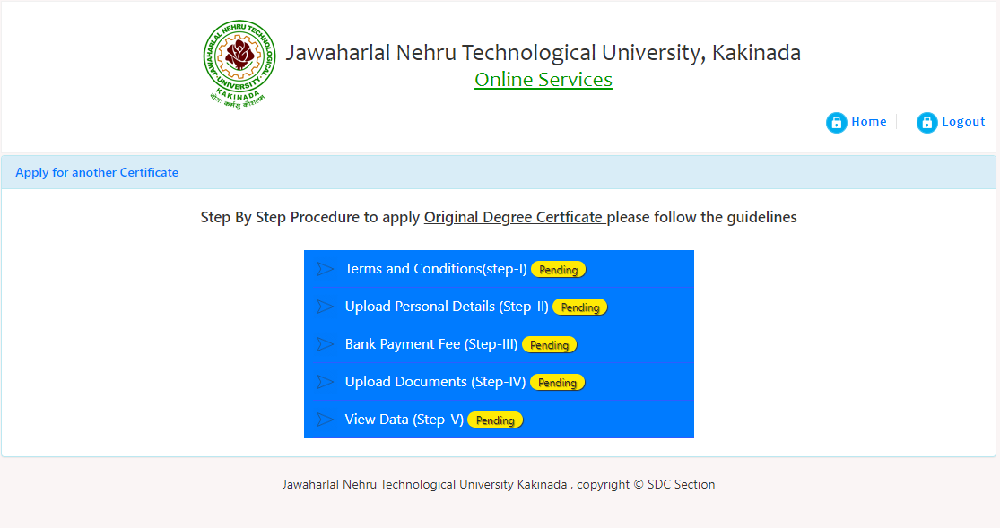
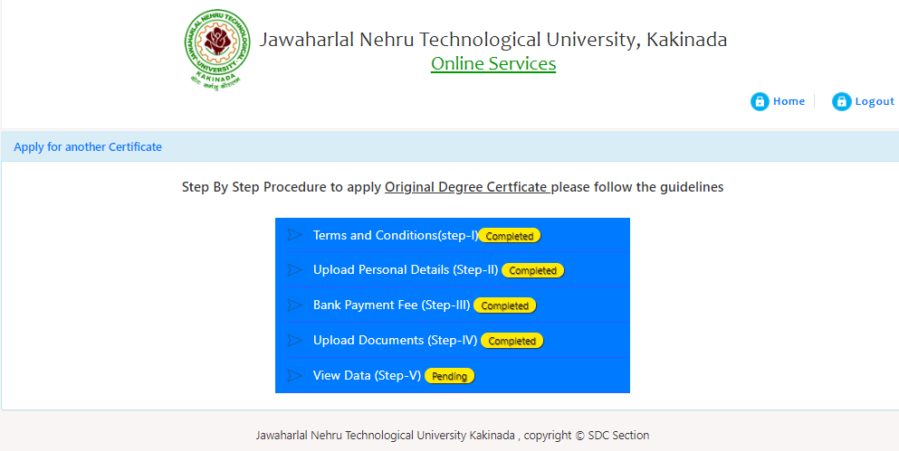

# Applying for OD (JNTU-K)

> Note: I have studied in Gayatri Vidya Parishad College of Engineering (A), Visakhapatnam which is affiliated to JNTUK. The process I'm writing here is same for students at JNTU and it's affiliated colleges (like ours's). 

### Prerequisites:
1. Provisional Certificate, shortly called as PC, pdf format and max size is 200kb
2. Consolidated Marks Memo, shortly called as CMM, pdf format and max size is 200kb pdf
3. Aadhar (Scanned copy of front and back as seperate pdfs) pdf format and max size is 200 kb each
4. SSC Marks Memo, pdf format and max size is 200kb.
5. Passport Size Photo. The following instructions are taken from [JNTUK website](https://www.jntukexams.net/online1/apply_online.php?m=p1#p1) 
    - Photograph must be a recent passport style colour picture.
    - Please Donot upload Selfie Photographs
    - Make sure that the picture is in colour, taken against a light-coloured, preferably white, background.
    - Look straight at the camera with a relaxed face if the picture is taken on a sunny day, have the sun behind you, or place yourself in the shade, so that you are not squinting and there are no harsh shadows if you wear glasses make sure that there are no reflections and your eyes can be clearly seen.
    - Caps,hats and dark glasses are not acceptable. Religious headwear is allowed but it must not cover your face.
    - Dimensions 456 x 568 pixels (preferred) Size of file should be between 80-100 kb
    - The image must be saved with your hallticket number for example:10791A0404.jpg
    - The image must be saved with jpg format. 

## Important Note

Generally the application portal may throw you an error like this (sorry for bad clarity) when you try to apply for OD. Remember to wait for 2 days from the date you have taken PC for their system to get updated. 

If the error persists for more than 2 days, contact JNTUK via their enquiry numbers. They will recitfy this within 2 days. I have faced this issue and luckily got it recitified within 3 hours (Lucky me.. :) )

## Process

### Step 1
Visit [this website](https://www.jntukexams.net/online1/apply_online.php?m=p1#p1) and Register with your details (if you don't have an account) or Login if you already have an account

### Step 2

After logging in, You are given an option to select the type of certificate to apply for. Select Original Degree and click submit.

Verify the amount shown in the blue box and click next to continue to application

> Note: Proceed only if you are shown that you are eligible for applying and the amount is shown correctly in the blue div

### Step 3

This page shows you the steps involved in the entire process. You will be navigated here each time you compelte a step. This page acts as a Todo list. Continue on to first step.

### Step 4

Read the instructions and Tick the checkbox and click submit.

### Step 5

If you complete a step, the steps window marks it as Completed. We are done with the first step i.e. Declaration . Proceed to next step "Upload Personal Details"

### Step 6

Again Read the instructions carefully on the left and proceed with caution. The details you enter here are crucial. Make sure you enter your name and your father's name as per SSC. Enter your correct Postal Address. 

After saving the details entered, we are done with the second step of our todo

### Step 7

Verify the amount shown and proceed to online payment. Once you finish the payment, the transaction details are autofilled into the application. But take a screenshot of the payment completion status for safety.

### Step 8

Select each file from your system and click upload next to it. Note that you can upload only one document at a time. Also note that once you complete the upload you won't be shown the filename of the file you uploaded. So, your mark for completion is the "Successful" message as status.

### Step 9

Your application will be shown here. Just check them. Tick the checkbox at the end. You will be redirected to your Declaration form. Save it to your system. 

### Declaration Form 

The declaration form looks like this. 
